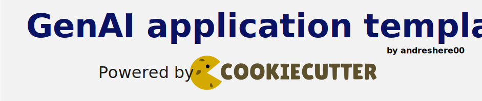

# GenAI-app-template

A cookiecutter template to build backend **GenAI-based** applications using Python.



## Introduction

Tired of starting generative AI projects from scratch? Do you find yourself constantly using the same packages but lacking a solid foundation to begin your project? Use this template!

This project suppose that you want to make your projects with the usual market tools: the LLM providers, the Vector databases, the Prompt Repositories... So you only have to select which technologies do you want, and voilà! You have a template to start any GenAI production-ready application in no time.

## Requisites

- **Python 3.12** or greater - [**Link**](https://www.python.org/downloads/)
- **UV** as recommended package manager - [**Link**](https://docs.astral.sh/uv/getting-started/installation/)
- **Cookiecutter** as template builder - [**Link**](https://cookiecutter.readthedocs.io/en/stable/README.html#installation)

## Usage

To create the template for your project, specify the following command in the terminal:

```sh
cookiecutter path/to/the/project/root
```

After executing this command, the console will prompt some questions in order to structure your project with your custom requirements:

```sh
  [1/8] project_name (GenAI application template): 
  [2/8] project_slug (genai-application-template): 
  [3/8] project_description (): 
  [4/8] project_version (0.1.0): 
  [5/8] author_name (andreshere00): 
  [6/8] author_email (andresherencia2000@gmail.com): 
  [7/8] llm_providers (Select among the available LLM Providers:
    1. Anthropic
    2. Azure OpenAI
    3. Bedrock
    4. Gemini
    5. Grok
    6. Ollama
    7. OpenAI
 e.g., '1,2,5''): 
  [8/8] Select services
    1 - none
    2 - chat
    Choose from [1/2] (1): 
```

- `project_name`: Name of the project. If no provided, default value between parenthesis will be taken.
- `project_slug`: Slug for the project. By default, will be the Project name formatted, without spaces, special characters and in strict lowercase.
- `project_description`: Description for the project. None by default.
- `project_version`: Version for the project.
- `author_name`: Name of the project author. Will be placed in the README and the `pyproject.toml` project config file. 
- `author_mail`: Mail of the project author. Same observations as `author_name`.
- `llm_providers`. The LLM providers that you want to implement for your project. Introduce the identifiers for each LLM, splitted by commas. Example: `1,2,5`.
- `services`: Select the services that you want to implement. Note that only Chat service is available at the moment. You can select among the available options providing the identifier number.

And that's it! If no validation errors raise, your application template is ready to be used.

## Next Steps

- [] Add support to use **MCP** (Model Context Protocol) Tools, Client and Server.
- [] Add support to use **Vector Databases** from different providers:
    - [] (Amazon) OpenSearch
    - [] Google Cloud Platform Vertex AI
    - [] Microsoft Azure AI Search
    - [] Qdrant
    - [] ElasticSearch
    - [] Custom
- [] Add support to use **Data Lakes** as document database:
    - [] Amazon S3 Buckets
    - [] Microsoft Azure Blob Storage
    - [] Google Cloud Storage
    - [] Custom
- [] Add support to use more **Prompt Repositories:**
    - [] Amazon DynamoDB
    - [] Microsoft Azure CosmosDB
    - [] Google Cloud Firestore
- [] Add support to use **caching & storage services** (TBD).
- [] Add **example services**:
    - [] RAG
    - [] MCP Server

## Contact

> If you want to collaborate with this project, don't hesitate to contact with me!

- Author: **Andrés Herencia** <[andresherencia2000@gmail.com](mailto:andresherencia2000@gmail.com)>
- Linkedin: [**Link**](https://www.linkedin.com/in/andres-herencia/)