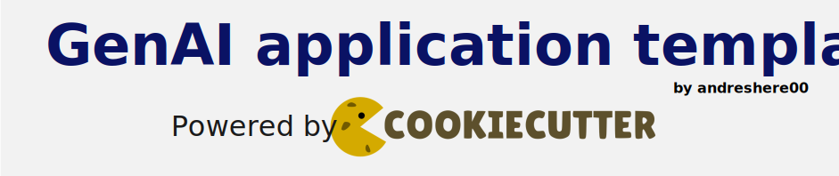

# GenAI-app-template

A cookiecutter template to build backend **GenAI-based** applications using Python.



## Introduction

Tired of starting generative AI projects from scratch? Do you find yourself constantly using the same packages but lacking a solid foundation to begin your project? Use this template!

This project suppose that you want to make your projects with the usual market tools: the LLM providers, the Vector databases, the Prompt Repositories... So you only have to select which technologies do you want, and voilà! You have a template to start any GenAI production-ready application in no time.

## Requisites

- **Python 3.12** or greater - [**Link**](https://www.python.org/downloads/)
- **UV** as recommended package manager - [**Link**](https://docs.astral.sh/uv/getting-started/installation/)
- **Cookiecutter** as template builder - [**Link**](https://cookiecutter.readthedocs.io/en/stable/README.html#installation)

## Usage

To create the template for your project, specify the following command in the terminal:

```sh
cookiecutter path/to/the/project/root
```

After executing this command, the console will prompt some questions in order to structure your project with your custom requirements:

```sh
  [1/10] project_name (GenAI application template): 
  [2/10] project_slug (genai-application-template): 
  [3/10] project_description (): 
  [4/10] project_version (0.1.0): 
  [5/10] author_name (andreshere00): 
  [6/10] author_email (andresherencia2000@gmail.com): 
  [7/10] llm_providers (Select among the available LLM Providers:
    1. Anthropic
    2. Azure OpenAI
    3. Bedrock
    4. Gemini
    5. Grok
    6. Ollama
    7. OpenAI
 e.g., '1,2,5'): 
  [8/10] Select services
    1 - none
    2 - chat
    3 - rag
    Choose from [1/2/3] (1): 
  [9/10] embedding_providers (Select among the available Embedding Providers:
    1. Azure OpenAI
    2. Bedrock
    3. Cohere
    4. Gemini
    5. Grok
    6. Ollama
    7. OpenAI
    8. VoyageAI
 e.g., '1,4,7'): 
  [10/10] vector_db (Select among the available Vector Databases:
    1. Cosmos DB
    2. Milvus
    3. MongoDB
    4. OpenSearch
    5. Pinecone
    6. Qdrant
    7. Vertex AI
 e.g., '1,3,6'): 
```

- `project_name`: Name of the project. If not provided, the default value between parenthesis will be taken.
- `project_slug`: Slug for the project. By default, will be the project name formatted without spaces, special characters and in strict lowercase.
- `project_description`: Description for the project. Empty by default.
- `project_version`: Version for the project.
- `author_name`: Name of the project author. Will be placed in the README and the `pyproject.toml` project config file.
- `author_email`: Email of the project author. Same observations as `author_name`.
- `llm_providers`: The LLM providers to include. Enter the identifiers separated by commas. Example: `1,2,5`.
- `services`: Select the service tier. Available options: `none`, `chat`, `rag`.
- `embedding_providers`: The embedding model providers to include. Enter the identifiers separated by commas. Example: `1,4,7`. Only applicable when `rag` service is selected; ignored otherwise.
- `vector_db`: The vector databases to include. Enter the identifiers separated by commas. Example: `1,3,6`. Only applicable when `rag` service is selected; ignored otherwise.

And that's it! If no validation errors raise, your application template is ready to be used.

## Next Steps

- [ ] Add support to use **MCP** (Model Context Protocol) Tools, Client and Server.
- [ ] Add support to use **Data Lakes** as document database:
    - [ ] Amazon S3 Buckets
    - [ ] Microsoft Azure Blob Storage
    - [ ] Google Cloud Storage
    - [ ] Custom
- [ ] Add support to use more **Prompt Repositories:**
    - [ ] Amazon DynamoDB
    - [ ] Microsoft Azure CosmosDB
    - [ ] Google Cloud Firestore
- [ ] Add support to use **caching & storage services** (TBD).
- [ ] Add **example services**:
    - [x] Chat
    - [ ] RAG
    - [ ] MCP Server

## Previously implemented

- [x] Add support to use **LLMs** (Large Language Models) from different providers:
    - [x] Anthropic
    - [x] Azure OpenAI
    - [x] Bedrock
    - [x] Gemini
    - [x] Grok
    - [x] Ollama
    - [x] OpenAI
- [x] Add support to use **Vector Databases** from different providers:
    - [x] Azure Cosmos DB
    - [x] Milvus
    - [x] MongoDB Atlas
    - [x] OpenSearch
    - [x] Pinecone
    - [x] Qdrant
    - [x] Google Vertex AI
- [x] Add support to use **Embedding Models** from different providers:
    - [x] Azure OpenAI
    - [x] Bedrock
    - [x] Cohere
    - [x] Gemini
    - [x] Grok
    - [x] Ollama
    - [x] OpenAI
    - [x] VoyageAI

## Contact

> If you want to collaborate with this project, don't hesitate to contact with me!

- Author: **Andrés Herencia** <[andresherencia2000@gmail.com](mailto:andresherencia2000@gmail.com)>
- Linkedin: [**Link**](https://www.linkedin.com/in/andres-herencia/)