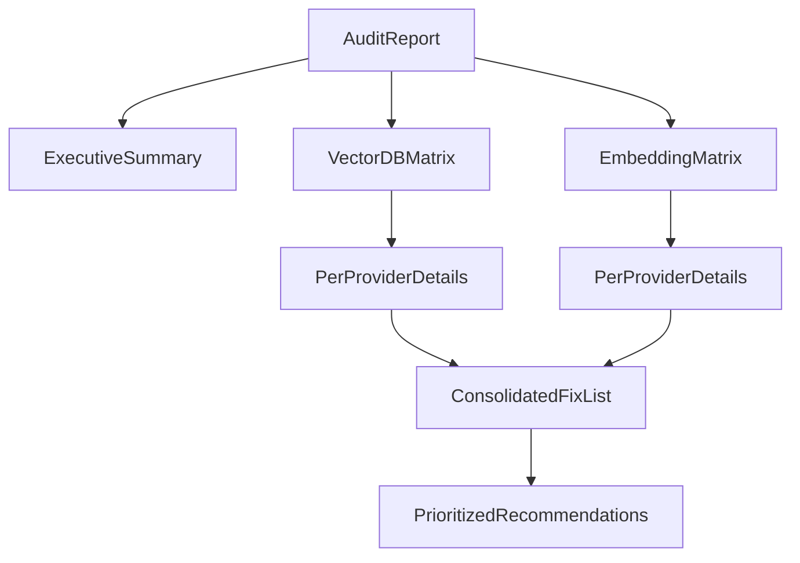

# Provider conformance audit

**Scope:** Vector DB adapters (7) and embedding adapters (8) under `src/infrastructure/`,
cross-referenced with `src/domain/vector/constants.py` and
`src/domain/embedding/constants.py`.  
**Authority:** Official provider / SDK documentation; LangChain integration docs as secondary
for embedding wrappers.  
**Date:** 2026-04-21.  
**Mode:** Read-only (no application code changes in this pass).

---

## Executive summary

| Area | Pass | Partial | Fail |
|------|------|---------|------|
| Vector DB | 1 (Pinecone shape aligns with v3 tuple upsert; core client usage OK) | 5 (Qdrant, Milvus, MongoDB, OpenSearch, Cosmos DB) | 1 (Vertex AI: vector ops are in-process only) |
| Embedding | 4 (OpenAI, Cohere, Gemini, VoyageAI thin wrappers) | 3 (Azure OpenAI param naming, Bedrock surface area, Ollama alias gaps) | 1 (Grok/xAI: embeddings via OpenAI-compatible stack unverified in public API docs) |

**Highest-impact gaps**

1. **Vertex AI** — `upsert` / `search` / `delete` use an in-memory dict, not Matching Engine
   index data plane APIs ([`vertex_db.py`](../../src/infrastructure/vector/adapters/vertex_db.py)).
2. **Azure Cosmos DB** — `search` loads items then ranks with local cosine similarity instead of
   server-side `VectorDistance` / vector index queries
   ([`cosmos_db.py`](../../src/infrastructure/vector/adapters/cosmos_db.py)).
3. **MongoDB** — `search` requires Atlas `$vectorSearch` and a vector index; `create_collection`
   does not create that index
   ([`mongo_db.py`](../../src/infrastructure/vector/adapters/mongo_db.py)).
4. **Milvus** — `metric_type` is derived via `str.upper()` on domain enum values; values like
   `EUCLIDEAN` / `DOT_PRODUCT` do not match typical Milvus identifiers (`L2`, `IP`)
   ([`milvus_db.py`](../../src/infrastructure/vector/adapters/milvus_db.py)).
5. **Azure OpenAI embeddings** — `api_version` is forwarded as-is; LangChain’s
   `AzureOpenAIEmbeddings` expects `openai_api_version` per integration docs
   ([`azure_openai.py`](../../src/infrastructure/embedding/adapters/azure_openai.py),
   [`constants.py`](../../src/domain/embedding/constants.py)).

---

## Vector DB pass / fail matrix

| Provider | Config conformance | Method conformance | Severity | Required fix (high level) |
|----------|-------------------|--------------------|----------|---------------------------|
| Cosmos DB | Partial | Partial | **High** | Use SQL vector search / `VectorDistance` for `search`; validate `CosmosClient` kwargs (`max_retries`, credential types). |
| Milvus | Partial | Partial | **Medium** | Map `DistanceMetric` to Milvus `metric_type` (`L2`, `IP`, …); consider `user`/`password` vs `token` parity with SDK. |
| MongoDB | Partial | Partial | **High** | Document Atlas-only `$vectorSearch`; add index-creation path or explicit prerequisites; clarify `_id` typing vs vectors. |
| OpenSearch | Partial | Partial | **Medium** | Align `knn` engine / `space_type` with target OpenSearch version (nmslib vs faiss / lucene). |
| Pinecone | Partial | Pass | **Low** | Confirm `timeout` and `host` semantics for control plane vs index host; wire `PINECONE_PARAM_MAP` or drop duplicate mapping. |
| Qdrant | Partial | Partial | **Medium** | Validate point `id` types (`PointStruct` / `PointIdsList`) vs string IDs; tighten `health()`. |
| Vertex AI | Partial | **Fail** | **Critical** | Implement vector CRUD against Matching Engine (batch + query endpoints), remove or isolate in-memory shim. |

---

## Embedding pass / fail matrix

| Provider | Config conformance | Method conformance | Severity | Required fix (high level) |
|----------|-------------------|--------------------|----------|---------------------------|
| Azure OpenAI | Partial | Partial | **Medium** | Map `api_version` → `openai_api_version`; align `model` vs `azure_deployment` with LangChain docs. |
| Bedrock | Partial | Pass | **Low** | Expose/document `region_name`, `credentials_profile_name`, keys per `BedrockEmbeddings`; `base_url` → `endpoint_url` already mapped. |
| Cohere | Pass | Pass | — | Optional: document `model` defaults. |
| Gemini | Pass | Pass | — | Optional: `task_type` / output dimension kwargs. |
| Grok (xAI) | Partial | **Fail** | **High** | Confirm public embeddings endpoint; if absent, remove provider or use supported client. |
| Ollama | Partial | Pass | **Low** | Add explicit param map for `base_url` aliases; document `EmbeddingProvider.HUGGINGFACE` mismatch. |
| OpenAI | Pass | Pass | — | — |
| VoyageAI | Pass | Pass | — | Optional: extra kwargs (`input_type`, etc.). |

---

## Vector DB adapters — details

### Cosmos DB (`cosmos_db.py`)

**Summary:** **Partial**

**Configuration vs `CosmosClient`**

- **Aligned:** `url`, `credential` (account key string), `connection_timeout`, `consistency_level`,
  `connection_policy` per Azure SDK
  ([CosmosClient](https://learn.microsoft.com/en-us/python/api/azure-cosmos/azure.cosmos.cosmosclient)).
- **Risks:**
  - `api_key` → `credential` via `COSMOS_PARAM_MAP`
    ([`13:16:src/domain/vector/constants.py`](../../src/domain/vector/constants.py),
    [`73:81:src/infrastructure/vector/adapters/cosmos_db.py`](../../src/infrastructure/vector/adapters/cosmos_db.py)):
    matches SDK pattern for key auth.
  - `max_retries` injected alongside resolved params
    ([`85:86:src/infrastructure/vector/adapters/cosmos_db.py`](../../src/infrastructure/vector/adapters/cosmos_db.py)):
    verify against current `CosmosClient` `**kwargs` / retry policy docs (may be ignored or
    routed via policy objects).

**Auth:** Account key (string) or extensible via `connection_policy` / future token credentials.

**Collection CRUD:** `create_container`, `delete_container`, `list_containers` — consistent with
Cosmos DB “container” model
([`141:192:src/infrastructure/vector/adapters/cosmos_db.py`](../../src/infrastructure/vector/adapters/cosmos_db.py)).

**Vector CRUD**

- **Upsert:** `ContainerProxy.upsert_item` — valid for storing vectors + payload
  ([`218:233:src/infrastructure/vector/adapters/cosmos_db.py`](../../src/infrastructure/vector/adapters/cosmos_db.py)).
- **Search:** **Not** native vector search — `query_items` + client-side cosine
  ([`235:262:src/infrastructure/vector/adapters/cosmos_db.py`](../../src/infrastructure/vector/adapters/cosmos_db.py)).
  Cosmos DB for NoSQL supports vector indexing and `VectorDistance` in SQL
  ([Vector search overview](https://learn.microsoft.com/en-us/azure/cosmos-db/nosql/vector-search)).
- **Delete:** `delete_item` with configurable partition key field
  ([`264:279:src/infrastructure/vector/adapters/cosmos_db.py`](../../src/infrastructure/vector/adapters/cosmos_db.py)):
  risk if partition key path ≠ `/id` or composite keys.

**Distance metrics:** No server metric mapping; ranking is always cosine in-process.

**Recommended fixes**

- Replace `search` with parameterized SQL using `VectorDistance` / vector index, or call the
  REST/API pattern documented for Cosmos vector search.
- Validate `max_retries` and document required vector index + embedding path on containers.

---

### Milvus (`milvus_db.py`)

**Summary:** **Partial**

**Configuration vs `MilvusClient`**

- **Aligned:** `uri`, `token`, `db_name`, `timeout` per PyMilvus `MilvusClient`
  ([MilvusClient](https://milvus.io/api-reference/pymilvus/v2.6.x/MilvusClient/Client/MilvusClient.md)).
- **Gap:** Username/password folded into `user:password` `token`
  ([`81:87:src/infrastructure/vector/adapters/milvus_db.py`](../../src/infrastructure/vector/adapters/milvus_db.py));
  SDK also supports explicit `user` / `password` — behavior should be documented and tested.

**Auth:** Token or user/password encoding.

**Collection CRUD:** `create_collection`, `drop_collection`, `list_collections`, `has_collection`
match high-level client API
([`128:187:src/infrastructure/vector/adapters/milvus_db.py`](../../src/infrastructure/vector/adapters/milvus_db.py)).

**Vector CRUD:** `upsert`, `search`, `delete` map to `MilvusClient` methods
([`191:248:src/infrastructure/vector/adapters/milvus_db.py`](../../src/infrastructure/vector/adapters/milvus_db.py)).

**Distance metrics:** `metric_type=config.metric.upper()`
([`142:143:src/infrastructure/vector/adapters/milvus_db.py`](../../src/infrastructure/vector/adapters/milvus_db.py))
with domain enum values `cosine`, `euclidean`, `dot_product`
([`19:27:src/domain/vector/types.py`](../../src/domain/vector/types.py)).
Milvus expects `COSINE`, `L2`, `IP`, etc. — **`EUCLIDEAN` / `DOT_PRODUCT` are likely invalid**.

**Search response shape:** Defensive `hit.get("entity")` / `distance` vs `score`
([`222:235:src/infrastructure/vector/adapters/milvus_db.py`](../../src/infrastructure/vector/adapters/milvus_db.py));
reasonable for SDK variance; confirm against deployed PyMilvus version.

**Recommended fixes**

- Introduce explicit `DistanceMetric` → Milvus metric map (`L2`, `IP`, …).
- Optionally pass `user`/`password` through when URI auth requires it.

---

### MongoDB (`mongo_db.py`)

**Summary:** **Partial**

**Configuration vs `MongoClient`**

- **Aligned:** Connection string via `host` keyword is accepted for URIs in PyMongo
  ([MongoClient](https://pymongo.readthedocs.io/en/stable/api/pymongo/mongo_client.html)).
- **Alias:** `timeout` → `serverSelectionTimeoutMS` via `MONGO_PARAM_MAP`
  ([`20:22:src/domain/vector/constants.py`](../../src/domain/vector/constants.py),
  [`102:112:src/infrastructure/vector/adapters/mongo_db.py`](../../src/infrastructure/vector/adapters/mongo_db.py)).

**Auth:** URI or host/port.

**Collection CRUD:** Standard PyMongo `create_collection` / `drop_collection`
([`159:214:src/infrastructure/vector/adapters/mongo_db.py`](../../src/infrastructure/vector/adapters/mongo_db.py))
— **does not** create a vector search index.

**Vector CRUD**

- **Upsert:** Stores `vector` + nested `payload` + `_id`
  ([`218:239:src/infrastructure/vector/adapters/mongo_db.py`](../../src/infrastructure/vector/adapters/mongo_db.py));
  Atlas vector search often expects the indexed path to match the index definition (commonly a
  top-level field, not nested under `payload`).
- **Search:** `$vectorSearch` aggregation
  ([`255:272:src/infrastructure/vector/adapters/mongo_db.py`](../../src/infrastructure/vector/adapters/mongo_db.py));
  **Atlas-only** ([Atlas Vector Search](https://www.mongodb.com/docs/atlas/atlas-vector-search/vector-search-overview/)).

**Distance metrics:** Not mapped; depends on index definition outside this adapter.

**Recommended fixes**

- Document Atlas requirement and vector index setup; optionally add helpers for index creation.
- Align document shape (`path` default `vector`) with how operators create collections.

---

### OpenSearch (`opensearch_db.py`)

**Summary:** **Partial**

**Configuration vs `OpenSearch` client**

- **Aligned:** `hosts`, `basic_auth`, `verify_certs`, `timeout`, `use_ssl`
  ([opensearch-py](https://opensearch-project.github.io/opensearch-py/))
  ([`16:22:src/infrastructure/vector/adapters/opensearch_db.py`](../../src/infrastructure/vector/adapters/opensearch_db.py)).

**Collection CRUD:** Index creation with `knn_vector` mapping; default `engine: nmslib`
([`165:182:src/infrastructure/vector/adapters/opensearch_db.py`](../../src/infrastructure/vector/adapters/opensearch_db.py)).
OpenSearch 2.x often uses **faiss** / **lucene** knn engines — defaults may fail on some clusters.

**Vector CRUD:** Index documents + `knn` query
([`237:291:src/infrastructure/vector/adapters/opensearch_db.py`](../../src/infrastructure/vector/adapters/opensearch_db.py)).

**Distance metrics:** `space_type` defaults from `config.metric` or `cosinesimil`
([`166:167:src/infrastructure/vector/adapters/opensearch_db.py`](../../src/infrastructure/vector/adapters/opensearch_db.py));
must match engine capabilities.

**Recommended fixes**

- Parameterize engine / method block per deployment version; document required cluster settings.

---

### Pinecone (`pinecone_db.py`)

**Summary:** **Partial** (config) / **Pass** (core methods vs v3)

**Configuration vs `Pinecone`**

- **Aligned:** `api_key`, `host` per Pinecone Python SDK
  ([Pinecone Python SDK](https://sdk.pinecone.io/python/rest.html)).
- **Note:** `PINECONE_PARAM_MAP` in domain (`collection` → `index_name`) exists
  ([`9:11:src/domain/vector/constants.py`](../../src/domain/vector/constants.py))
  but **is not imported** by the adapter; index name resolved manually
  ([`62:68:src/infrastructure/vector/adapters/pinecone_db.py`](../../src/infrastructure/vector/adapters/pinecone_db.py)).
- **Risk:** `timeout` merged into `Pinecone(**params)`
  ([`52:59:src/infrastructure/vector/adapters/pinecone_db.py`](../../src/infrastructure/vector/adapters/pinecone_db.py));
  confirm SDK supports it or strip it.

**Vector CRUD:** Tuple `(id, values, metadata)` upsert and `query` with `include_metadata=True`
match v3 patterns
([`198:237:src/infrastructure/vector/adapters/pinecone_db.py`](../../src/infrastructure/vector/adapters/pinecone_db.py))
([Vectors](https://sdk.pinecone.io/python/db_data/index-usage-byov.html)).

**Recommended fixes**

- Use or delete `PINECONE_PARAM_MAP`; validate `timeout` / `host` usage (control vs data plane).

---

### Qdrant (`qdrant_db.py`)

**Summary:** **Partial**

**Configuration vs `QdrantClient`**

- Allowed keys match common constructor args
([`18:29:src/infrastructure/vector/adapters/qdrant_db.py`](../../src/infrastructure/vector/adapters/qdrant_db.py))
([Qdrant Python client](https://python-client.qdrant.tech/)).

**Collection CRUD:** `create_collection`, `delete_collection`, `get_collections`,
`collection_exists` — aligned
([`139:205:src/infrastructure/vector/adapters/qdrant_db.py`](../../src/infrastructure/vector/adapters/qdrant_db.py)).

**Vector CRUD**

- **Upsert:** `PointStruct(id=record.id, …)`
  ([`216:222:src/infrastructure/vector/adapters/qdrant_db.py`](../../src/infrastructure/vector/adapters/qdrant_db.py)):
  Qdrant point IDs are **unsigned int or UUID**; arbitrary strings may be rejected.
- **Delete:** `PointIdsList(points=ids)` with `list[str]`
  ([`253:264:src/infrastructure/vector/adapters/qdrant_db.py`](../../src/infrastructure/vector/adapters/qdrant_db.py)):
  same typing concern.

**Distance metrics:** `DistanceMetric` → `Distance` enum
([`31:35:src/infrastructure/vector/adapters/qdrant_db.py`](../../src/infrastructure/vector/adapters/qdrant_db.py)) —
good.

**Health:** `http_client is not None`
([`132:134:src/infrastructure/vector/adapters/qdrant_db.py`](../../src/infrastructure/vector/adapters/qdrant_db.py))
is weak vs `get_collections()`.

**Recommended fixes**

- Coerce or validate IDs; improve health check.

---

### Vertex AI (`vertex_db.py`)

**Summary:** **Partial** (admin) / **Fail** (data plane)

**Configuration vs `aiplatform.init`**

- Uses `project`, `location`, `credentials`, `api_key`, `request_timeout`
  ([`90:103:src/infrastructure/vector/adapters/vertex_db.py`](../../src/infrastructure/vector/adapters/vertex_db.py));
  `api_key` is supported in recent SDK versions
  ([Vertex AI SDK](https://cloud.google.com/python/docs/reference/aiplatform/latest)).
- **Alias map:** `database` → `project_id`, `collection` → `index_name`
  ([`24:27:src/domain/vector/constants.py`](../../src/domain/vector/constants.py)):
  naming is confusing vs generic `VectorDBConfig`.

**Collection CRUD:** `MatchingEngineIndex.create_tree_ah_index`, `list`, `delete`
([`157:233:src/infrastructure/vector/adapters/vertex_db.py`](../../src/infrastructure/vector/adapters/vertex_db.py))
— plausible admin APIs; `distance_measure_type=config.metric or "COSINE"` may need SDK enum types
not raw strings.

**Vector CRUD:** **In-memory only**
([`248:289:src/infrastructure/vector/adapters/vertex_db.py`](../../src/infrastructure/vector/adapters/vertex_db.py));
does not call Matching Engine **upload**, **query**, or **remove** datapoints APIs.

**Recommended fixes**

- Replace `_memory_store` paths with official Matching Engine data plane operations (batch upsert,
  query neighbor, delete).
- Align metric / index lifecycle parameters with
  [Vertex AI Vector Search docs](https://cloud.google.com/vertex-ai/docs/vector-search/overview).

---

## Embedding adapters — details

### Azure OpenAI (`azure_openai.py`)

**Summary:** **Partial**

- Wraps `AzureOpenAIEmbeddings` with `resolve_parameters` + alias map
  ([`46:60:src/infrastructure/embedding/adapters/azure_openai.py`](../../src/infrastructure/embedding/adapters/azure_openai.py)).
- **Gap:** `AZURE_OPENAI_EMBEDDING_PARAM_MAP` keeps `api_version` → `api_version`
  ([`5:10:src/domain/embedding/constants.py`](../../src/domain/embedding/constants.py));
  LangChain documents **`openai_api_version`**
  ([Azure OpenAI embeddings](https://docs.langchain.com/oss/python/integrations/text_embedding/azure_openai)).
- **Gap:** `model` remapped to `azure_deployment`; LangChain also exposes `model` — ensure callers
  are not surprised when both are needed.

**Method:** `embed_documents` on client — **Pass**
([`BaseEmbedding.embed`](../../src/infrastructure/embedding/base.py)).

**Recommended fixes**

- Map `api_version` → `openai_api_version`; document deployment vs model naming.

---

### Bedrock (`bedrock.py`)

**Summary:** **Partial**

- Maps `model` → `model_id`, `base_url` → `endpoint_url`
  ([`14:17:src/domain/embedding/constants.py`](../../src/domain/embedding/constants.py),
  [`43:52:src/infrastructure/embedding/adapters/bedrock.py`](../../src/infrastructure/embedding/adapters/bedrock.py));
  matches `BedrockEmbeddings` fields
  ([reference](https://reference.langchain.com/python/langchain_aws/embeddings/bedrock/BedrockEmbeddings)).
- Strips `api_key` — **correct** (AWS credential chain)
  ([`51:52:src/infrastructure/embedding/adapters/bedrock.py`](../../src/infrastructure/embedding/adapters/bedrock.py)).

**Method:** **Pass**

**Recommended fixes**

- Document `region_name`, `credentials_profile_name`, and explicit AWS keys for deployments.

---

### Cohere (`cohere.py`)

**Summary:** **Pass**

- `api_key` → `cohere_api_key`; `CohereEmbeddings(**params)`
  ([`cohere.py`](../../src/infrastructure/embedding/adapters/cohere.py)).

---

### Gemini (`gemini.py`)

**Summary:** **Pass**

- `api_key` → `google_api_key`; `GoogleGenerativeAIEmbeddings`
  ([`gemini.py`](../../src/infrastructure/embedding/adapters/gemini.py)).

---

### Grok / xAI (`grok.py`)

**Summary:** **Fail** (conformance to **documented** xAI capability)

- Uses `OpenAIEmbeddings` with `openai_api_base` / `openai_api_key` and default
  `https://api.x.ai/v1`
  ([`15:56:src/infrastructure/embedding/adapters/grok.py`](../../src/infrastructure/embedding/adapters/grok.py)).
- Public xAI REST reference materials emphasize chat/completions; **embeddings endpoint support
  is not established** from the same first-party doc surface as chat
  ([xAI API reference](https://docs.x.ai/docs/api-reference)).

**Method:** Would **Pass** only if `/v1/embeddings` exists and is OpenAI-compatible.

**Recommended fixes**

- Confirm embeddings with xAI; otherwise remove shim or gate behind explicit capability flag.

---

### Ollama (`ollama.py`)

**Summary:** **Partial**

- No alias map file; passes `base_url` / `model` directly
  ([`ollama.py`](../../src/infrastructure/embedding/adapters/ollama.py)).
- **Naming debt:** Provider enum `EmbeddingProvider.HUGGINGFACE` for Ollama
  ([`15:16:src/infrastructure/embedding/adapters/ollama.py`](../../src/infrastructure/embedding/adapters/ollama.py))
  is misleading vs LangChain’s `OllamaEmbeddings`
  ([Ollama embeddings](https://docs.langchain.com/oss/python/integrations/text_embedding/ollama)).

**Method:** **Pass**

**Recommended fixes**

- Add optional aliases (`host` → `base_url`) if configs use mixed keys; rename provider enum or
  document mapping.

---

### OpenAI (`openai.py`)

**Summary:** **Pass**

- Standard param map to `openai_api_key`, `openai_api_base`, `openai_organization`
  ([`openai.py`](../../src/infrastructure/embedding/adapters/openai.py)).

---

### VoyageAI (`voyageai.py`)

**Summary:** **Pass**

- `api_key` → `voyage_api_key`; `VoyageAIEmbeddings`
  ([`voyageai.py`](../../src/infrastructure/embedding/adapters/voyageai.py))
  ([langchain-voyageai](https://pypi.org/project/langchain-voyageai/)).

---

## Consolidated prioritized fix list

1. **P0 — Vertex AI:** Replace in-memory vector store with Matching Engine datapoint upload/query/delete
   ([`248:289:src/infrastructure/vector/adapters/vertex_db.py`](../../src/infrastructure/vector/adapters/vertex_db.py)).
2. **P0 — Cosmos DB:** Implement server-side vector query (`VectorDistance` / indexed vectors)
   ([`235:262:src/infrastructure/vector/adapters/cosmos_db.py`](../../src/infrastructure/vector/adapters/cosmos_db.py)).
3. **P1 — MongoDB:** Document Atlas + vector index prerequisites; align schema with `$vectorSearch`
   path; optional index helper
   ([`159:272:src/infrastructure/vector/adapters/mongo_db.py`](../../src/infrastructure/vector/adapters/mongo_db.py)).
4. **P1 — Milvus:** Fix distance metric mapping (`L2` / `IP` / …)
   ([`142:143:src/infrastructure/vector/adapters/milvus_db.py`](../../src/infrastructure/vector/adapters/milvus_db.py)).
5. **P1 — Grok:** Verify embeddings API or deprecate adapter
   ([`grok.py`](../../src/infrastructure/embedding/adapters/grok.py)).
6. **P2 — Azure OpenAI embeddings:** `api_version` → `openai_api_version`
   ([`constants.py`](../../src/domain/embedding/constants.py),
   [`azure_openai.py`](../../src/infrastructure/embedding/adapters/azure_openai.py)).
7. **P2 — OpenSearch:** Version-aware knn engine / mapping defaults
   ([`165:182:src/infrastructure/vector/adapters/opensearch_db.py`](../../src/infrastructure/vector/adapters/opensearch_db.py)).
8. **P2 — Qdrant:** Point ID typing + stronger health
   ([`216:264:src/infrastructure/vector/adapters/qdrant_db.py`](../../src/infrastructure/vector/adapters/qdrant_db.py)).
9. **P3 — Pinecone:** Reconcile `PINECONE_PARAM_MAP` vs manual `collection` handling; validate
   `timeout` on `Pinecone()`
   ([`pinecone_db.py`](../../src/infrastructure/vector/adapters/pinecone_db.py)).
10. **P3 — Ollama:** Provider enum naming / alias map
    ([`ollama.py`](../../src/infrastructure/embedding/adapters/ollama.py)).

---

## References (official / primary)

- [Azure Cosmos DB Python — CosmosClient](https://learn.microsoft.com/en-us/python/api/azure-cosmos/azure.cosmos.cosmosclient)
- [Cosmos DB vector search](https://learn.microsoft.com/en-us/azure/cosmos-db/nosql/vector-search)
- [PyMilvus MilvusClient](https://milvus.io/api-reference/pymilvus/v2.6.x/MilvusClient/Client/MilvusClient.md)
- [PyMongo MongoClient](https://pymongo.readthedocs.io/en/stable/api/pymongo/mongo_client.html)
- [MongoDB Atlas Vector Search](https://www.mongodb.com/docs/atlas/atlas-vector-search/vector-search-overview/)
- [opensearch-py client](https://opensearch-project.github.io/opensearch-py/)
- [Pinecone Python SDK](https://sdk.pinecone.io/python/rest.html)
- [Qdrant Python client](https://python-client.qdrant.tech/)
- [Vertex AI SDK for Python](https://cloud.google.com/python/docs/reference/aiplatform/latest)
- [Vertex AI Vector Search](https://cloud.google.com/vertex-ai/docs/vector-search/overview)
- [LangChain — Azure OpenAI embeddings](https://docs.langchain.com/oss/python/integrations/text_embedding/azure_openai)
- [LangChain — BedrockEmbeddings](https://reference.langchain.com/python/langchain_aws/embeddings/bedrock/BedrockEmbeddings)
- [LangChain — Ollama embeddings](https://docs.langchain.com/oss/python/integrations/text_embedding/ollama)
- [xAI API reference](https://docs.x.ai/docs/api-reference)

---

## Self-check

- Every adapter file under
  `src/infrastructure/vector/adapters/` and `src/infrastructure/embedding/adapters/` (excluding
  `__init__.py`) is cited above.
- Constructor kwargs are traced either to SDK/LangChain docs or flagged (**Risks** / **Gap**).
- No source files outside `docs/audits/` were modified for this audit deliverable.
